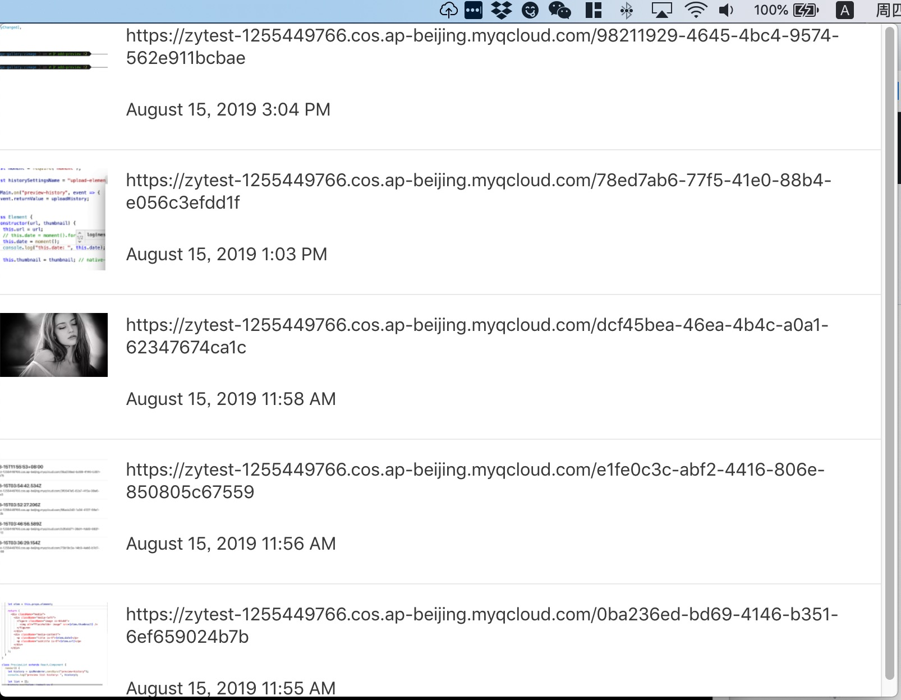
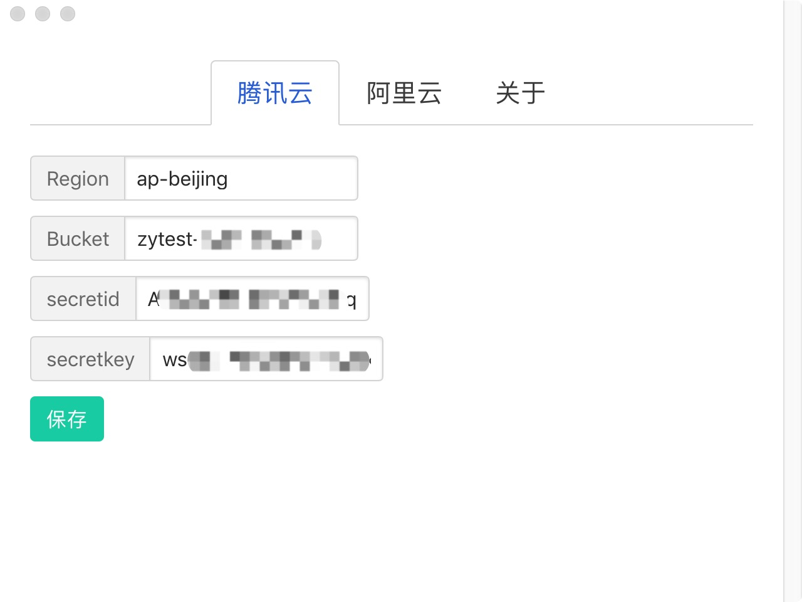
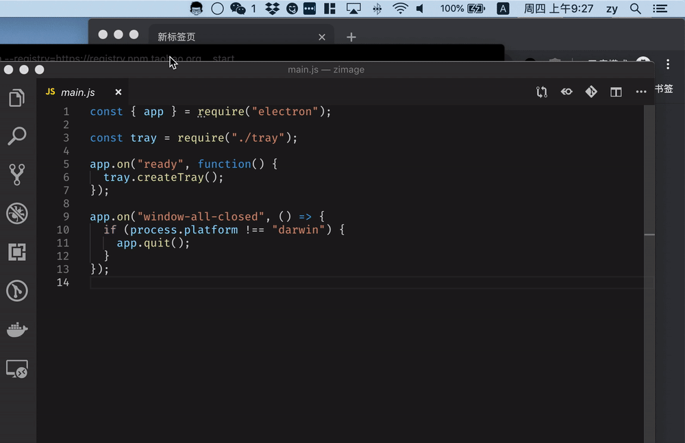

# my-image-gallery

我的图床

- 开源！免费！🆓
- 基于Electron，跨平台
- 多版本
  - 服务器/命令行版本：基于Golang
  - 桌面版本：基于Electron，系统支持：MacOS，即将支持：Windows、Linux；
- 多存储后端选择：
  - 腾讯云的对象存储：COS
  - 即将支持更多的对象存储


## 开发


```bash
cd zimage

npm install

npm start
```


## 编译

```bash
yarn run package
```

应用程序生成目录：`./out/zimage-darwin-x64`

## 打包

```bash
yarn run make
```

打包程序生成目录：`./out/make/`

## 示例

1. 配置COS
2. 复制需要上传的图片
3. 图片的URL在上传后，自动被粘贴到剪切板


### 界面预览


**历史预览**

右键点击图标，显示历史预览。




**配置界面**




### 上传复制的图片

**操作**

2. 复制图片、截图、“Ctrl+C”等等
3. 点击上传


### 上传截图

**操作**

1. 使用工具进行截图：微信自带功能、[腾讯jietu](https://jietu.qq.com/)
2. 点击上传





### 上传本地文件

**操作**

1. 复制图片，“CTRL+C”，或者“Cmd+C”
2. 点击上传


